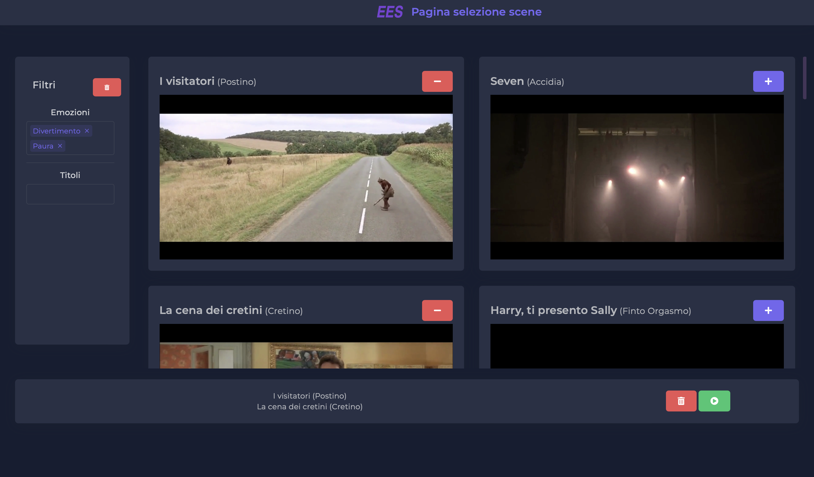
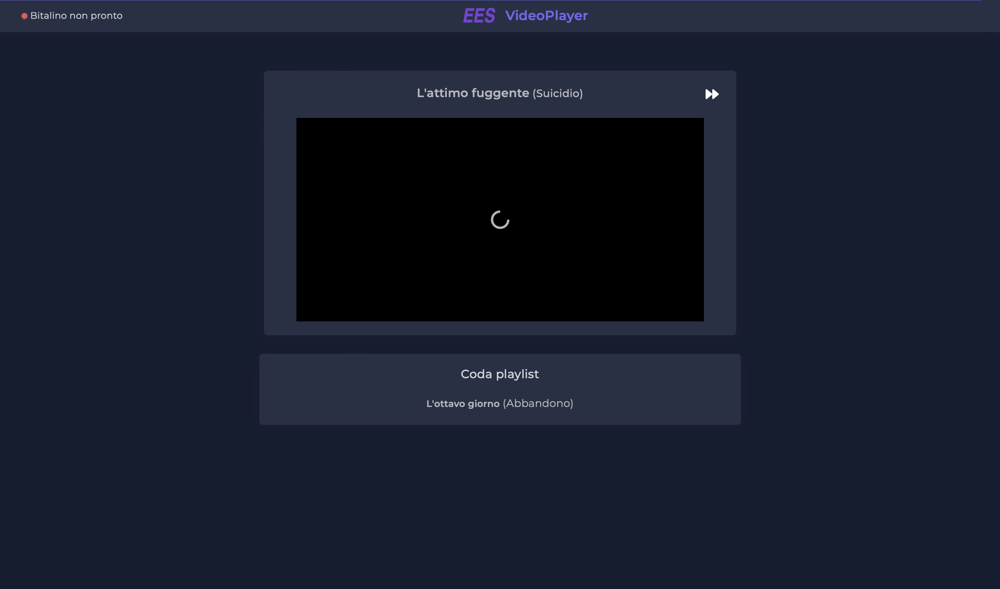
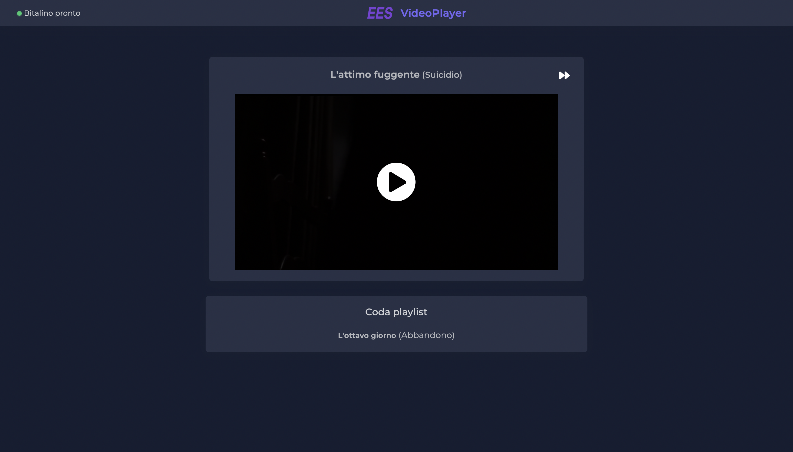
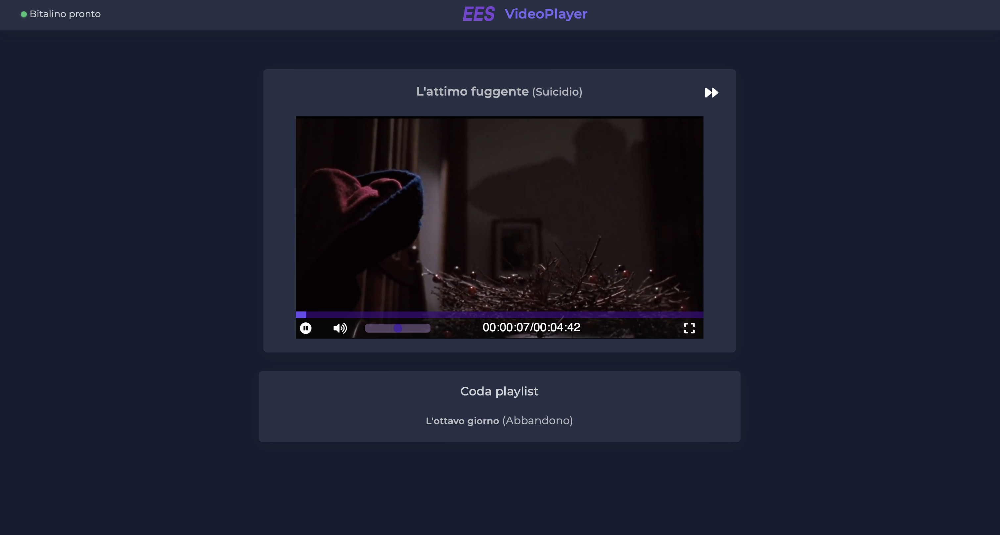
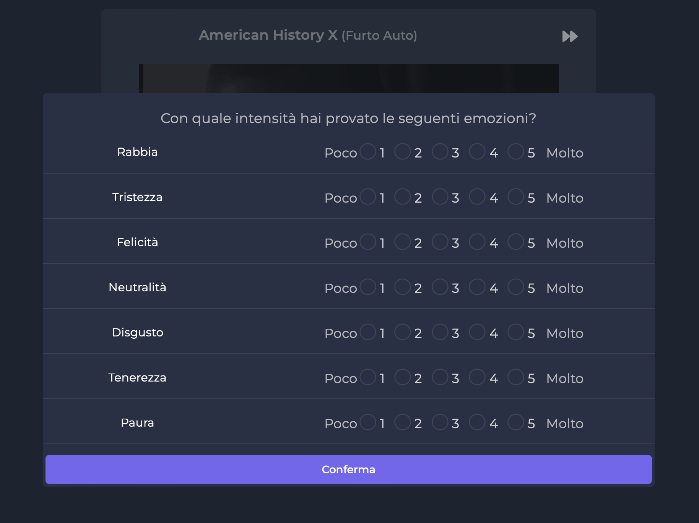
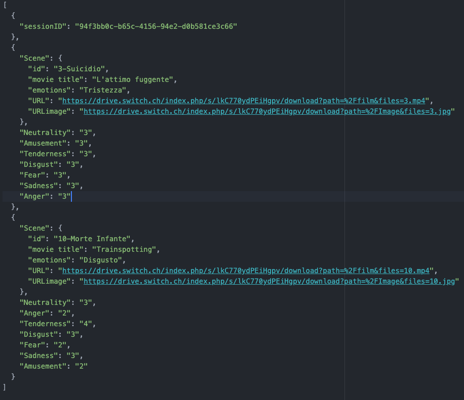

# EmotionElicitationSystem

Simple Emotion Elecitation using movies scenes.
Data are acquired through:
- Questions form after each scene
- ECG EDA EEG EMG PZT PPG analys

It can be upgrade and maybe can have some bugs feel free to modify it as you want if necessary
## Install
You need to install first of all [node.js](https://nodejs.org/it/download/)
and [.Net Framework](https://dotnet.microsoft.com/en-us/download/dotnet-framework)

Just download the git repository and inside a terminal move inside
```
/EmotionElicitationSystem/Application
```
and just run:
```
npm install
```
it will install all the required modules.

## Run
With a terminal move inside the folder  
```
/EmotionElicitationSystem/Application/NodeSocket
```
and run the command:
```
node WebSocket.js
```

Inside another terminal  move inside the folder
```
/EmotionElicitationSystem/SocketCommunication/MessageBroker
```
and run the command:
```
dotnet run
```

## Start Analysies
Just open in your browser the file:
```
/EmotionElicitationSystem/Application/html/ltr/OperatorPage.html
```
Here the test operator can select the scenes that the user has to see. All the chosen scenes are saved in a playlist that can clear or played when the operator is satisfied



When the play button is pressed the "Player.html" page will be loaded.
When loading the page will request the bitalino status to the MessageBroker.
The bitalino status is showed on the top left corner of the page with a red(offline) or green(ready) dot.




 When bitalino answers with an "OK" status, the scene can be played.




The user can control the video (time position, volume, play pause, fullscreen),
and if she/he wants pressing the button on the top right corner of the video can skip the track.



Each time the video is played or paused a message is sent to the bitalino so that he can also pause or continue the sampling. If the video has been skipped another message will be sent to the bitalino in order to delete the sampling for that scenes.

Once the video is over a modal will show up asking the user how strong he/she sensed each emotions in a scale from 1 (very little) to 5(high).



When the confirm button is pressed the answer will be saved and a message will be send to the bitalino with the unique id of the current session and the scene id ("sessionId_sceneId"), in this way we can relate the analyses with the correct user.

Once all the scenes are been watched all the answers will be saved in a json format inside the folder:
```
/EmotionElicitationSystem/Application/NodeSocket/statistics
```

with the name "sessionId.json"

example:
  -94f3bb0c-b65c-4156-94e2-d0b581ce3c66.json

